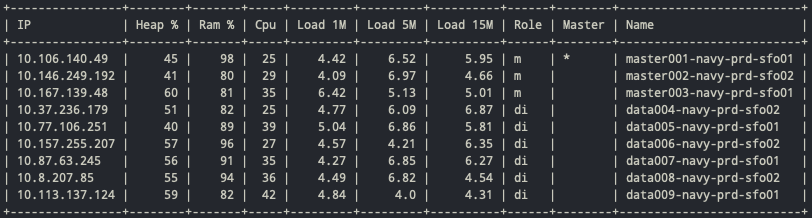

<h1 align="center">
  <br/>
  Esctl
  <br/>
</h1>

<h4 align="center">A Command-Line Interface designed to ease Elasticsearch administration.</h4>

<p align="center">
  <a href="https://github.com/jeromepin/esctl/actions?query=workflow%3A%22Lint+and+test%22+branch%3Amaster">
    
  </a>
  <a href="https://github.com/jeromepin/esctl/actions?query=workflow%3A%22Publish+%F0%9F%93%A6%22+branch%3Amaster">
    
  </a>

  <a href="https://www.codefactor.io/repository/github/jeromepin/esctl">
      
  </a>

  <a href="https://sonarcloud.io/dashboard?id=jeromepin_esctl">
    
  </a>
</p>

<p align="center">
  <a href="#key-features">Key Features</a> •
  <a href="#installation">Installation</a> •
  <a href="#how-to-use">How To Use</a> •
  <a href="#examples">Examples</a> •
  <a href="#license">License</a> •
  <a href="#developing">Developing</a>
</p>

<hr/>

Esctl is a CLI tool for Elasticsearch. [I designed it](https://jeromepin.fr/posts/esctl-managing-elasticsearch-from-command-line/) to shorten huge `curl` commands Elasticsearch operators were running like :

```bash
curl -XPUT --user "john:doe" 'http://elasticsearch.example.com:9200/_cluster/settings' -d '{
    "transient" : {
        "cluster.routing.allocation.enable": "NONE"
    }
}'
```

The equivalent with `esctl` is

```bash
esctl cluster routing allocation enable none
```

## Key Features

* **Easy to use CLI** rather than long curl commands (thanks to [cliff](https://github.com/openstack/cliff))
* Cluster-level informations : **stats**, **info**, **health**, **allocation explanation**
* Node-level informations : **list**, **hot threads**, **exclusion**, **stats**
* Cluster-level and index-level **settings**
* `_cat` API for **allocation**, **plugins** and **thread pools**
* **Index management** : open, close, create, delete, list
* `raw` command to perform raw HTTP calls when esctl doesn't provide a nice interface for a given route.
* Per-module **log configuration**
* X-Pack APIs : **users** and **roles**
* **Multiple output formats** : table, csv, json, value, yaml
* [JMESPath](https://jmespath.org/) queries using the `--jmespath` flag
* Colored output !
* Run arbitrary pre-commands before issuing the call to Elasticsearch (like running `kubectl port-forward` for example)
* Fetch cluster's credentials from external commands instead of having them shown in cleartext in the config file


## Installation

### Using PIP

```bash
pip install esctl
```

### From source

```bash
pip install git+https://github.com/jeromepin/esctl.git
```


## How To Use

Esctl relies on a `~/.esctlrc` file containing its config. This file is automatically created on the first start if it doesn't exists :

```yaml
clusters:
  bar:
    servers:
      - https://bar.example.com

users:
  john-doe:
    username: john
    external_password:
      command:
        run: kubectl --context=bar --namespace=baz get secrets -o json my-secret | jq -r '.data.password||@base64d'

contexts:
  foo:
    user: john-doe
    cluster: bar

default-context: foo
```

### Running pre-commands

Sometimes, you need to execute a shell command right before running the `esctl` command. Like running a `kubectl port-forward` in order to connect to your Kubernetes cluster.
There is a `pre_commands` block inside the context which can take care of that :

```yaml
clusters:
  remote-kubernetes:
    servers:
    - http://localhost:9200
contexts:
  my-distant-cluster:
    cluster: remote-kubernetes
    pre_commands:
    - command: kubectl --context=my-kubernetes-context --namespace=elasticsearch port-forward svc/elasticsearch 9200
      wait_for_exit: false
      wait_for_output: Forwarding from
    user: john-doe
```

Along with `command`, you can pass two options :
* `wait_for_exit` (_default_: `true`) : wait for the command to exit before continuing. Usually set to `false` when the command is running in the foreground.
* `wait_for_output` : if `wait_for_exit` is `false`, look for a specific output in the command's stdout. The string to look-for is interpreted as a regular expression passed to Python's [re.compile()](https://docs.python.org/3.7/library/re.html).


## Examples

<p align="center">
  
</p>


## License

`esctl` is licensed under the GNU GPLv3. See [LICENCE](https://github.com/jeromepin/esctl/blob/master/LICENSE) file.

## Developing

### Install

```bash
make install
```

### Run tests

```bash
make test
```

### Format code

```bash
make fmt
```
